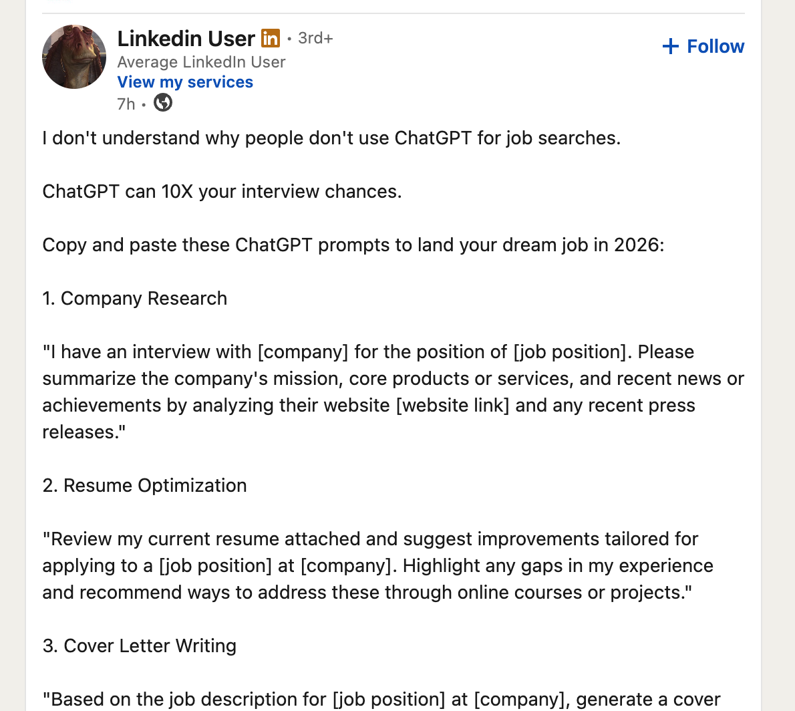
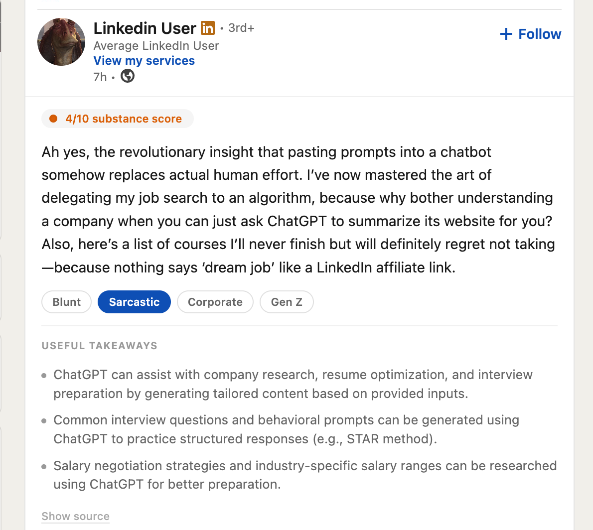

# linkedin-unfiltered

chrome extension that translates linkedin posts into what people actually mean.

---

## what it does

scroll linkedin, see corporate buzzwords and engagement bait, hit **unfilter**. an ai translates it into honest, blunt text. for entertainment only.

features:
- **instant translate** — one click on any post
- **personalities** — blunt, sarcastic, corporate, gen z
- **substance score** — 0-10 rating of how much is actually being said
- **auto-translate** — hover for 5 seconds, it translates automatically
- **dark mode** — follows linkedin's theme

---

## in action

| before | after |
|--------|-------|
|  |  |

---

## install

**firefox** → [addons.mozilla.org](https://addons.mozilla.org/en-US/firefox/addon/linkedin-unfiltered/)

**chrome** → download `chrome.zip` from the [latest release](https://github.com/kjhq/linkedin-unfiltered/releases), then:

1. open `chrome://extensions`
2. enable **developer mode**
3. drag `chrome.zip` onto the page

---

## setup

1. click the extension icon → open settings
2. add your api key (mistral / openrouter / any openai-compatible provider)
3. choose default personality
4. enable / disable auto-translate toggle

---

## stack

no build step. vanilla js, manifest v3, chrome storage api.

`javascript` `chrome extension` `ai`

---

## privacy

- api key stays in browser local storage — never leaves your device
- post content sent directly to the ai provider you configure
- nothing logged, nothing tracked, nothing sold

---

## license

[mit](LICENSE)

---

built by [kjhq](https://kjhq.dev) · [@kjhqdev](https://x.com/kjhqdev)

