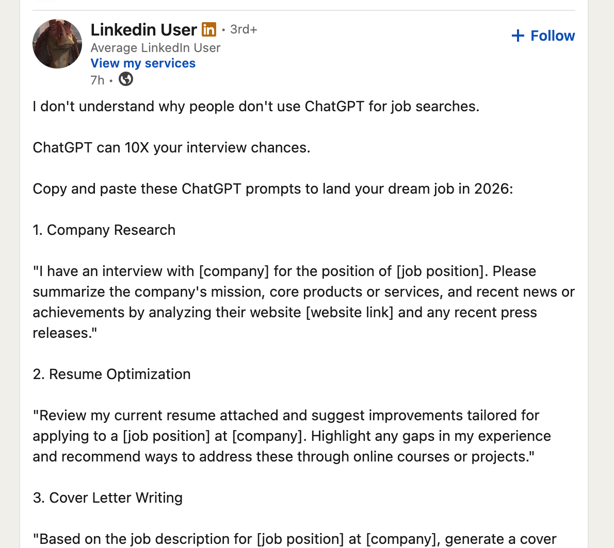
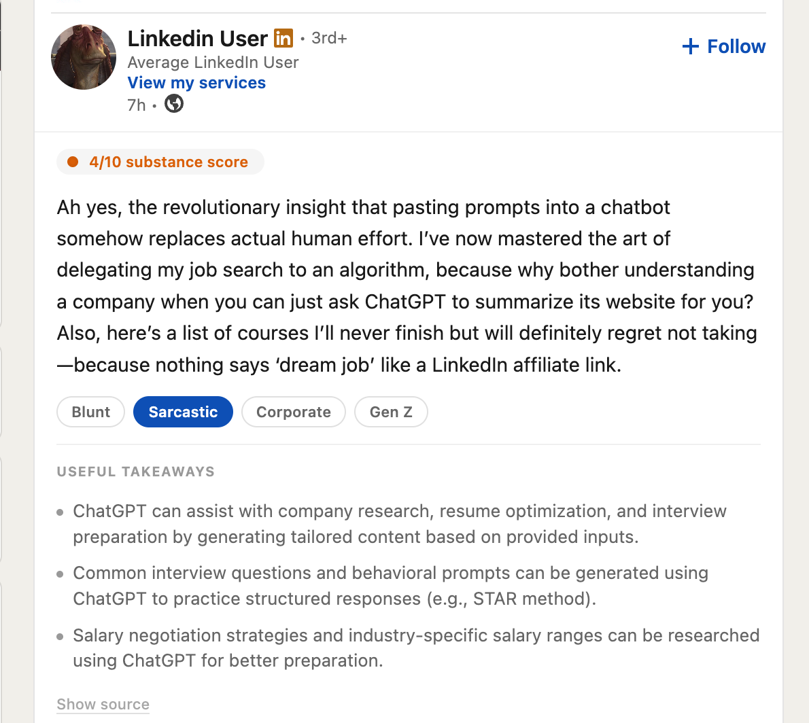
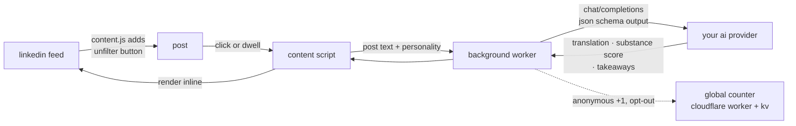

<div align="center">


# linkedin-unfiltered

**see what people actually mean on linkedin.**
a browser extension that translates corporate speak and engagement bait into honest, blunt text. for entertainment only.

[](https://addons.mozilla.org/en-US/firefox/addon/linkedin-unfiltered/)
[](https://github.com/kjhq/linkedin-unfiltered/releases/latest)
[](https://developer.mozilla.org/docs/Web/JavaScript)
[](https://developer.chrome.com/docs/extensions/develop/migrate/what-is-mv3)
[](https://workers.cloudflare.com/)
[](LICENSE)

</div>

---

## in action

| before | after |
|--------|-------|
|  |  |

---

## features

- **instant translate**: an **unfilter** button on every post, one click
- **personalities**: blunt, sarcastic, corporate, gen z
- **substance score**: a 0-10 rating of how much is actually being said
- **useful takeaways**: optionally pulls out any real data or advice buried in the post
- **auto-analyze**: translates posts that stay on screen for a few seconds (1-30 s, default 5)
- **bring your own model**: mistral, openai, groq, openrouter, google, deepinfra and more, or any openai-compatible endpoint you add yourself
- **resilient**: retries with backoff on rate limits and provider errors
- **dark mode**: follows linkedin's theme
- **translation counter**: your own count plus an anonymous global one (opt-out)

---

## how it works


```mermaid
flowchart LR
    P[linkedin feed] -->|content.js adds<br/>unfilter button| B[post]
    B -->|click or dwell| CS[content script]
    CS -->|post text + personality| BG[background worker]
    BG -->|chat/completions<br/>json schema output| AI[your ai provider]
    AI -->|translation · substance score<br/>· takeaways| BG
    BG --> CS -->|render inline| P
    BG -.->|anonymous +1, opt-out| CNT[global counter<br/>cloudflare worker + kv]
```

the background worker sends the post text to the openai-compatible `/chat/completions` endpoint you configured, with a personality-specific system prompt and a json schema for the response. the result is rendered inline under the post. the popup loads the provider and model list from [models.dev](https://models.dev).

---

## install

**firefox**: [addons.mozilla.org](https://addons.mozilla.org/en-US/firefox/addon/linkedin-unfiltered/)

**chrome**: download `chrome.zip` from the [latest release](https://github.com/kjhq/linkedin-unfiltered/releases/latest), unzip it, then:

1. open `chrome://extensions`
2. enable **developer mode**
3. click **load unpacked** and pick the unzipped folder

---

## setup

1. click the extension icon to open the popup
2. pick a provider and paste your api key (mistral is the default, with a free tier)
3. choose a model and a default personality
4. optionally turn on auto-analyze and set the view duration

---

## development

no build step. load the repo folder directly:

```bash
git clone https://github.com/kjhq/linkedin-unfiltered.git
```

- **chrome**: `chrome://extensions` → developer mode → **load unpacked** → the repo folder (uses `manifest.json`)
- **firefox**: copy the files to a temp folder, rename `manifest-firefox.json` to `manifest.json`, then load it from `about:debugging` → **this firefox** → **load temporary add-on**

### releases

pushing a `v*` tag runs [`.github/workflows/release.yml`](.github/workflows/release.yml), which builds `chrome.zip` and `firefox.zip` and attaches them to a github release.

### counter worker

the global counter is a small cloudflare worker backed by workers kv (`GET` returns the count, `POST` adds one):

```bash
cd counter-worker
npm install
npm run dev      # local
npm run deploy   # wrangler deploy
```

it needs a kv namespace bound as `COUNTER` in `wrangler.jsonc`.

---

## tech stack

| part | tech |
|---|---|
| extension | vanilla javascript, css, manifest v3, `chrome.storage` |
| ai | any openai-compatible chat completions api, models from models.dev |
| counter | cloudflare workers + workers kv, deployed with wrangler |
| ci | github actions release workflow |

---

## project structure

```
linkedin-unfiltered/
├── manifest.json           # chrome (mv3, service worker)
├── manifest-firefox.json   # firefox (mv3, background scripts)
├── background.js           # prompts, provider calls, retries, counter
├── content.js              # unfilter button, auto-analyze, inline results
├── styles.css              # injected styles, light + dark
├── popup.html / popup.js   # provider, model, personality and settings
├── icons/
├── screenshots/
├── counter-worker/         # cloudflare worker for the global counter
├── PRIVACY.md
└── .github/workflows/release.yml
```

---

## privacy

- your api key stays in the browser's local extension storage and is only sent to the provider you configure
- post text is sent directly to that ai provider, nowhere else
- the global counter receives an anonymous +1 per translation, no post text or identifiers, and can be turned off in the popup
- nothing logged, nothing tracked, nothing sold

full details in [PRIVACY.md](PRIVACY.md).

---

## license

[mit](LICENSE)

---

<div align="center">

built by [kjhq](https://kjhq.dev) · [@kjhqdev](https://x.com/kjhqdev)

</div>
